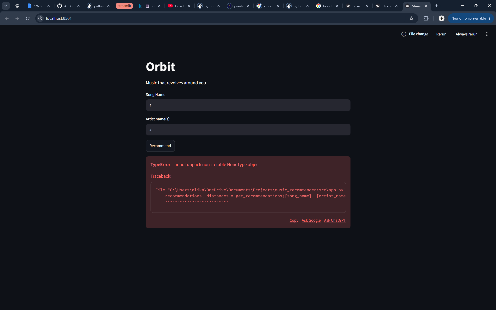
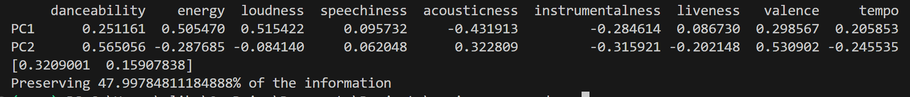

### 15/06/2026
- planning on complete overview of project completed

### 16/06/2026
- Realised only removing same song IDs is not sufficient to remove all duplicates
had to also remove songs that had the same exact artist and same exact song name
- Chose standardisation rather than normalisation because some attributes contain outliers and KNN relies on distance calculations.

- Original dataset: 114000 songs
- Unique track IDs: 89741
- Significant number of duplicates removed

- reasoned about similaity features that should be taken into consideration for song recommendations 

### 17/06/2026
- Implemented version 1 of KNN song recommendation system
- Songs suggested were all mathematically similar
- Tested out model with wide range of songs such as Drake's One Dance and God's Plan, Mac Miller's cinderella and the songs suggested 
were all really good. Suggested songs broke the language barrier and even genre barrier that is usually faced
when trying to find similar songs - helped discover new artists and even new genres
    - Enter song name: One Dance
Enter artist name: Drake;Wizkid;Kyla
           track_name                                artists
41188       One Dance                      Drake;Wizkid;Kyla
33270        Badabing                   buller;LKN;El Chilli
18364     Your Matter                   Seyi Shay;Eugy;Efosa
44553  Cate's Brother                          Maisie Peters
51804   Somos Iguales  Ozuna;Tokischa;Louchie Lou;Michie One
321    Slow Down Time                             Us The Duo
- I found that equal weighting of all features produced reasonable results, but I plan to allow users to adjust feature importance to make it more tailored for the user
- using a small dataset that is 4 years old so perhaps using spotify's api later on will lead to better and more accurate song recommendations
    - noticed some songs suggested were not available on spotify anymore

- recommendation judged accurate for now
- starting off with smaller dataset leads to new discoveries of song taste

### 18/06/2026
- manual playlist style query, playlist embedding
    - find average song attribute values and find similar songs to average
    - setting up for future where user enters spotify public playlist link and program will find suggestions
    for the playlist
- implemented first version of streamlit application

- interesting recommendation: smack that by akon and eminem closest song being: Ich bin stark by rolf zuckowski which does not have the same vibe whatsoever one is rap the other a nursey rhyme
    - realised lyrics play an important role in music vibe and thus recommendation
    - they share the same danceability/tempo but differed heavily on genre context and lyrical mood
- added distance rounded to 3 dp to table on streamlit for user

### 19/06/2026
- first phase of feature scaling, user can adjust depending on preferences how they want to get recommended songs
- added sliders that user can adjust and fine tune to get more personalised recommendations
    - but it can be fiddly and having slider a few degrees off leads to different songs so user may miss out on songs, maybe have some presets for users who aren't as comfortable with music terminology or who don't know exactly what they like
- I started with equal weighting after standardisation, then added user-controlled feature weighting to let users customise the similarity metric instead of assuming one universal definition of vibe
- originally had all 9 sliders on screen, too overwhelming and too much finetuning may reduce to 3-4 instead
- added presets to make it easier for user to define how they want to get recommended songs
- similarity depends on the definition of similarity
- will need to further improve presets with user feedback perhaps
    - realised that feature weights do not mean “make this feature high or low.”  
    They mean “how important is it that this feature matches the query song?”
    For example, increasing the energy weight does not mean recommending high-energy songs. It means recommendations must have energy values closer to the query song’s energy
- added tickbox option for user to fine tune recommendation system themselves if they want to

### 20/06/2026
- integrating spotify web api via spotipy
- added spotify link to every song so can instantly go to spotify and play song
    - tested with Apocalypse by Cigarettes After Sex and all songs recommended were accurate and had accurate links to Spotify
- made whole app feel more polished and less of a dataframe website and more of a song recommendation website
- added corresponding album covers to make app feel more polished
- implemented simple match score as that's more useful than distance score for user, intentionally didn'y say accuracy or likelihood of liking song
- noticed bug: entered beautiful (feat. Camila Cabello) and it suggested ranked 1 song same song but with match of 99.4% distance of 0.006 - dataset has repeated song wasnt removed since one is without (feat. Camila Cabello) even though she is featured in the song so wasn't classified as a duplicate

### 21/06/2026
- added ability for user to choose from manually inputting song name and artist or pasting spotify link
    - added this feature since realised how common it is to have typo or not know everyone who is featured in a song, now it's easy to get recommendations via pasting spotify link
    - maybe add feature that shows the details of the song you pasted to make sure correct song was inputted
- annoying having relatively small dataset as more often than not the user's decided song to use as input will not be in the dataset
- planing to add spotify public playlist link capability for user, program will have to adapt depending on what link is sent, user shouldn't have to specify that its a playlist etc. so can have a cleaner UX design

### 24/06/2026
- added ability to enter spotify public playlist link, easier for user than manually entering all songs
    - songs from entered playlist that are also in the database are only used, the other songs are ignored as there is no data about the song's information
    - sign to perhaps increase dataset size
- trying to access more than 50 songs at a time from entered playlist

### 26/06/2026
- fixed bug which incorrectly only checked maximum of 45 songs in any given playlist
- noticed program taking far longer to recommend songs when playlist is at a larger scale e.g playlist of 220 songs
    - decided to start implementaion of kmeans clustering so Orbit will only need to use KNN on a smaller dataset (songs that are in the same cluster as the query vector)
        - will enable discovery of new types of songs and discover musical regions
        - may even display graphs showing how songs are connected, i.e. display the clusters
        - faster recommendations speed
        - Songs with similar values across those features tend to gather into "regions" rather than strange geometric shapes- that makes K-Means a pretty reasonable algorithm for Orbit
- added cluster number to every song in new csv file
- implemented elbow test to find suitable k value for k means clustering
    - elbow appears to be 7-9 but that shouldn't mean instantly letting k = 7-9
    
        - Hyperparameter tuning computationally expensive, running the test took a few minutes

- carried out cluster analysis, distribution of clusters and their sizes
    - noticed every k clusters had a smaller cluster, curious as it could indicate Orbit discovering a new niche genre of music
    - the smaller clusters still persist even as K increases which strongly suggests there to be a niche genre or style of music within the dataset perhaps classical 
    - ==== K = 3 ===
cluster
0    28430
1    35682
2    17231
Name: count, dtype: int64
Inertia 508595.5342217324

==== K = 7 ===
cluster
0    18346
1    24049
2    16136
3     1023
4     9732
5     6256
6     5801
Name: count, dtype: int64
Inertia 340264.9989980618

==== K = 10 ===
cluster
0     9158
1    12171
2     9685
3    14360
4     4467
5    10076
6     5832
7     5333
8      908
9     9353
Name: count, dtype: int64
Inertia 293875.6391673481

==== K = 25 ===
cluster
0     2288
1     4272
2     3958
3     3126
4     1927
5      551
6     5463
7     3581
8     2484
9      895
10    3311
11    4457
12    4838
13    1909
14    2697
15    3690
16    2249
17    2659
18    3713
19    4578
20    6607
21    2639
22    2433
23    2798
24    4220
Name: count, dtype: int64
Inertia 209446.349067789

- carried out PCA
    - 
    - 
    - 
    - 
    - from PCA its apparent there are obvious regions 
    - increasing k subdivides the broad regions
    - pca was useful to see that the clustering isn't random but isn't good to have a quantitive score of how well the clustering actually is
        - since 9d was compressed to 2d obviously there will be overlaps in the graph
- aim to implement silhouette score to get a quantitative measure of how well the clustering is for every k value in [3,7,10,25]
- analysed the pca further and noticed on 48% of data was preserved when transorming 9D information to 2D
    - 
    - explains why data was messier the higher the k-value (52% of data about the songs wasn't being  on the plot)
    - PC1 almost looks like: modern energetic music <-> acoustic/quieter music
    - PC2 is harder to judge but looked like: Happy/danceable/acoustic vs Instrumental/lower-energy/faster